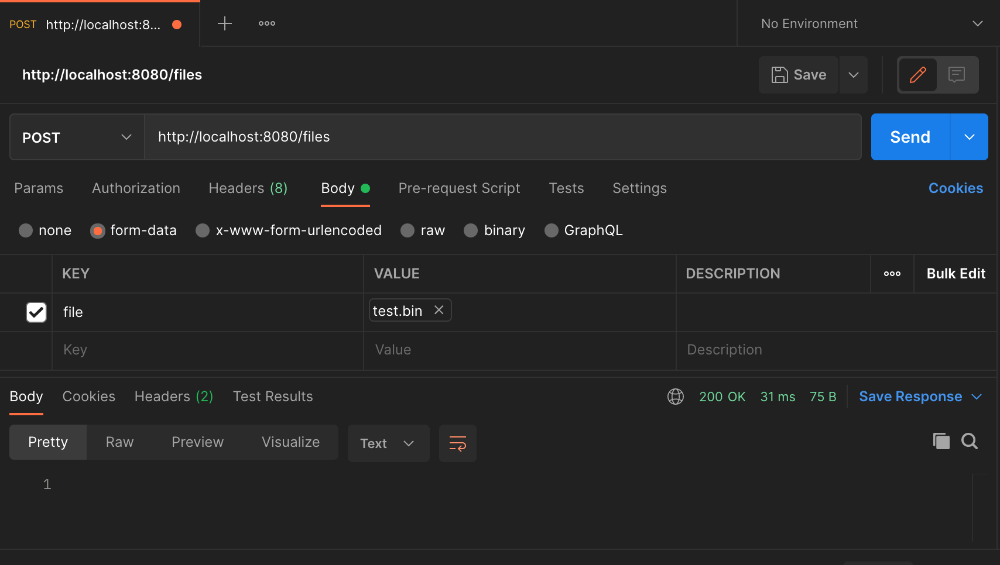

# fs

fs is a simple server program that provides support for the followng workflow.

**Data provider:**

- Upload a binary file containing a 2 dimensional array of integers in csv format to the server.
- Remove a previously uploaded binary file from the server.

**Data analyst:**

- Retrieve a list of all files available on the server.
- Retrieve the details of a specific file, such as the number of rows and columns.
- Accept a request to compute the summation of a list of integers given by the analyst. Each integer in the list is uniquely identifiable by a resource identifier, row and column index. The results of the computation must be made accessible to the analyst.

## Install

To be updated

## How to run and test

Download and install Postman for testing. Run the server and initiate an appropriate request to http://localhost:8080/files via Postman. Test data is available in the data/ directory.

### Upload File

Send a POST request to http://localhost:8080/files. The request body must be of the type multipart/form-data, where "file" is the key and "data/test.csv" is the value, the binary file to be sent.

