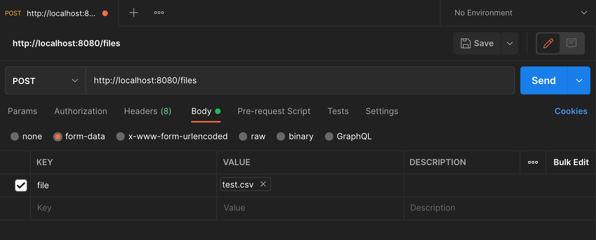

# fs

fs is a simple server program that provides support for the followng workflow.

**Data provider:**

- Upload a binary file containing a 2 dimensional array of integers in csv format to the server.
- Remove a previously uploaded binary file from the server.

**Data analyst:**

- Retrieve a list of all files available on the server.
- Retrieve the details of a specific file, such as the number of rows and columns.
- Accept a request to compute the summation of a list of integers given by the analyst. Each integer in the list is uniquely identifiable by a resource identifier, row and column index. The results of the computation must be made accessible to the analyst.

---

## Install

To run from source code, do the following in your terminal of choice:

```
> git clone https://github.com/t-junjie/fs.git
> cd fs/
> go run main.go
// ctrl + c/ cmd + c to stop the server program
```

Alternatively, in your terminal

```
> go install github.com/t-junjie/fs/...
> fs
// ctrl + c/ cmd + c to stop the server program
```

This will start the server program.

---

## How to run and test

- Download and install [Postman](https://www.postman.com/downloads/) for testing.
- Run the server and initiate an appropriate request to http://localhost:8080/files via Postman.
- Test data is available in the testdata/ directory.
- Test cases are stated below.

<br>

### Upload a binary file containing a 2 dimensional array of integers in csv format to the server

- Send a POST request to http://localhost:8080/files.
- The request body must be of the type multipart/form-data, where "file" is the key and "data/test.csv" is the value, the binary file to be sent.



<br>

### Retrieve a list of all files available on the server

- Send a GET request to http://localhost:8080/files

### Retrieve the details of a specific file, such as the number of rows and columns

- Send a GET request to http://localhost:8080/v1/files/{fileID}

### Remove a previously uploaded binary file from the server

- Send a DELETE request to http://localhost:8080/v1/files/{fileID}

### Compute sum of list integers

- Send a POST request to http://localhost:8080/v1/files/sum
- HTTP request body must contain a json of the following format:
  `[{uuid,row,col},{uuid,row,col}...]` where uuid is the resource identifier for the uploaded csv file, row and col are the indices (zero-based) of the csv file.

### Test Cases

- Note that uuid is automatically generated by the server and might not be the same as what is stated below.

---

| Checked | Request Type |                Endpoint                 |                                                                 Request Body                                                                  | Status Code |                                                         Response Body                                                         | Remarks                                                                                                                         |
| :-----: | :----------: | :-------------------------------------: | :-------------------------------------------------------------------------------------------------------------------------------------------: | :---------: | :---------------------------------------------------------------------------------------------------------------------------: | ------------------------------------------------------------------------------------------------------------------------------- |
|  `[x]`  |     GET      |     http://localhost:8080/v1/files/     |                                                                     empty                                                                     |     200     |  `{"files":[{"id": "cb6a5e12-d582-46df-94d8-97e3cfa64006", "name": "test.csv","size": "30.4 kB","rows": 100,"cols": 104}]}`   | if no files are present, files will be an empty array                                                                           |
|  `[x]`  |     POST     |     http://localhost:8080/v1/files/     |                                                     multipart/form-data (with .csv file)                                                      |     200     | `{"files": {"id": "311ed6fe-0374-4bb5-9d4e-1b3166189a81", "name": "test.csv", "size": "30.4 kB", "rows": 100, "cols": 104 }}` |                                                                                                                                 |
|  `[x]`  |     POST     |     http://localhost:8080/v1/files/     |                                                   multipart/form-data (other file formats)                                                    |   400/500   |                                             `{"error": "unable to process file"}`                                             |                                                                                                                                 |
|  `[x]`  |     GET      | http://localhost:8080/v1/files/{fileID} |                                                                     empty                                                                     |     200     | `{"files": {"id": "311ed6fe-0374-4bb5-9d4e-1b3166189a81", "name": "test.csv", "size": "30.4 kB", "rows": 100, "cols": 104 }}` |                                                                                                                                 |
|  `[x]`  |     GET      | http://localhost:8080/v1/files/{fileID} |                                                                     empty                                                                     |     400     |                                                  `{"error": "invalid uuid}`                                                   |                                                                                                                                 |
|  `[x]`  |     GET      | http://localhost:8080/v1/files/{fileID} |                                                                     empty                                                                     |     404     |                                                 `{"error": "file not found"}`                                                 |                                                                                                                                 |
|  `[x]`  |    DELETE    | http://localhost:8080/v1/files/{fileID} |                                                                     empty                                                                     |     200     | `{"files": {"id": "311ed6fe-0374-4bb5-9d4e-1b3166189a81", "name": "test.csv", "size": "30.4 kB", "rows": 100, "cols": 104 }}` |                                                                                                                                 |
|  `[x]`  |    DELETE    | http://localhost:8080/v1/files/{fileID} |                                                                     empty                                                                     |     400     |                                                  `{"error": "invalid uuid}`                                                   |                                                                                                                                 |
|  `[x]`  |    DELETE    | http://localhost:8080/v1/files/{fileID} |                                                                     empty                                                                     |     404     |                                                 `{"error": "file not found"}`                                                 |                                                                                                                                 |
|  `[x]`  |     POST     |   http://localhost:8080/v1/files/sum    | raw/json : `[{"uuid":"3a3192fd-d5b0-468a-bbf1-a066b9f1b679","row":1,"col":2},{"uuid":"3a3192fd-d5b0-468a-bbf1-a066b9f1b63","row":4,"col":5}]` |     200     |                                                         `{"sum": 10}`                                                         | `{uuid,row,col}` represents a value from cell(row,col) in the file with fileID=uuid. Note that row, col are zero-based indices. |
|  `[x]`  |     POST     |   http://localhost:8080/v1/files/sum    | raw/json : `[{"uuid":"3a3192fd-d5b0-468a-bbf1-a066b9f1b679","row":1,"col":2},{"uuid":"3a3192fd-d5b0-468a-bbf1-a066b9f1b63","row":4,"col":5}]` |     400     |                                                             `{}`                                                              | Invalid `{uuid,row,col}` specified in request body or wrong request content type                                                |
